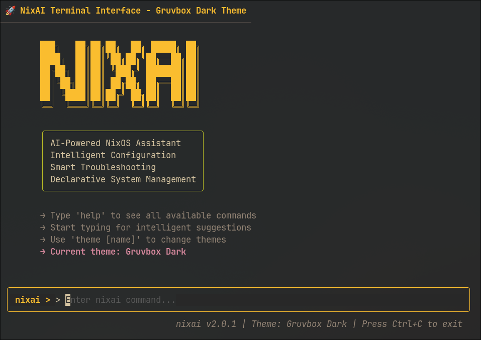
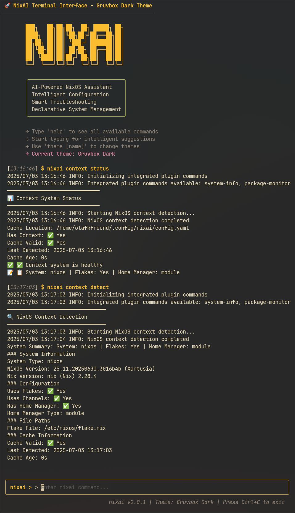

# nixai: NixOS AI Assistant


---

## 🌟 Slogan

**nixai: Revolutionary AI-powered NixOS management platform with 40+ specialized commands — run instantly with nix run, leverage 7 AI providers, manage multi-machine fleets, and master NixOS with intelligent agents, modern web interface, and comprehensive plugin ecosystem.**

## 🆕 Latest Updates (July 2025)

### 🚀 **v2.0.0: Revolutionary AI-Powered NixOS Management Platform**

- **⚡ Instant Access**: Run directly with `nix run github:olafkfreund/nix-ai-help` - no installation required!
- **🌐 Modern Web Interface**: Responsive dashboard with visual configuration builder, team collaboration, and real-time monitoring
- **📚 Built-in Manual System**: 28+ comprehensive documentation topics with interactive navigation and offline access
- **🤖 Multi-Provider AI**: 7 AI providers including OpenAI, Claude, Gemini, Groq, Ollama, and GitHub Copilot
- **🌍 Fleet Management**: Multi-machine deployment with rolling strategies, health monitoring, and centralized configuration
- **🔌 Advanced Plugin System**: 14 plugin management commands with secure sandboxing and community marketplace
- **🎯 Enhanced TUI**: Claude Code-style interface with dual-panel layout and real-time command execution
- **📝 Configuration Templates**: Built-in templates with GitHub integration and marketplace for community sharing
- **🔗 Editor Integration**: Enhanced MCP server with nix run support for seamless VS Code/Neovim integration
- **🧠 AI Intelligence**: System analysis, conflict detection, predictive recommendations, and automated troubleshooting

### ✨ **Modern TUI Interface** - **NEWLY COMPLETED!**

- **🎨 Icon-Free Design**: 100% accessible text-based interface without Unicode dependencies
- **📖 Enhanced Typography**: Larger, more readable text with improved visual hierarchy
- **📜 Smart Scrolling**: Text-based scroll indicators with Page Up/Down support
- **ℹ️ Version Display**: nixai version prominently shown in status bar
- **📰 Changelog Popup**: Press ? to view latest features and updates
- **⌨️ Better Navigation**: Improved keyboard shortcuts and panel switching
- **🔧 Interactive Parameter Input**: All complex commands now support TUI parameter configuration
- **📊 Real-Time Output**: Command execution with live output display within TUI
- **🎯 Command Discovery**: Enhanced command browser with `[INPUT]` indicators for configurable commands

### 🚀 **Enhanced Command System** - **8 MAJOR COMMANDS UPGRADED!**

- **🔨 Build System**: 10 specialized subcommands for comprehensive build troubleshooting and optimization
- **📦 Package Analysis**: AI-powered Git repository analysis with automatic Nix derivation generation
- **🩺 Advanced Diagnostics**: Multi-format log analysis with AI-powered issue detection and fixes
- **⚙️ Interactive Configuration**: 8-flag NixOS configuration generator with desktop, server, and minimal presets
- **🗑️ Intelligent Garbage Collection**: 4 subcommands for AI-guided safe cleanup and generation management
- **💻 Hardware Optimization**: 6 specialized hardware tools with auto-detection and performance tuning
- **🔄 Migration Assistant**: AI-powered channel-to-flakes migration with backup and rollback support
- **📝 Neovim Integration**: Complete Neovim setup with 5 management commands and MCP integration

### 🚀 **Breakthrough Features in 2.0.0**

- **🎯 nix run Integration**: Primary installation method with automatic dependency resolution and ephemeral mode
- **📚 Comprehensive Manual System**: Complete offline documentation with 28+ topics and interactive navigation
- **🌍 Enterprise Fleet Management**: Multi-machine deployment with rolling strategies and health monitoring
- **🤖 7-Provider AI Ecosystem**: Enhanced provider system with Claude, Groq, Gemini 2.5 Flash, and intelligent fallbacks
- **🔗 Enhanced Editor Integration**: MCP server with auto-detection and improved VS Code/Neovim support
- **🌐 Advanced Web Dashboard**: Visual configuration builder with drag-and-drop and real-time collaboration
- **📝 Template Marketplace**: Built-in templates with GitHub integration and community sharing
- **🧠 AI Intelligence System**: System analysis, conflict detection, and predictive recommendations
- **🔧 Modern TUI Architecture**: Dual-panel interface with real-time execution and enhanced navigation
- **🛡️ Security & Performance**: Enhanced plugin sandboxing, optimized caching, and comprehensive testing

---

## 🎮 Modern TUI Experience

nixai offers two powerful TUI interfaces to suit different preferences:

### 🚀 **Claude Code-Style Interface** (Default: `nixai tui`)

A modern, streamlined interface inspired by Claude Code with a command-focused design:

```text
┌─ nixai TUI ─────────────────────────────────────────────────────────────────┐
│                                                                            │
│ Welcome to nixai! Type commands below and see results above.               │
│                                                                            │
│ Available commands: ask, search, explain-option, hardware, build, ...     │
│ Type 'help' for command list or 'exit' to quit.                          │
│                                                                            │
│ > ask "How do I configure nginx in NixOS?"                               │
│                                                                            │
└────────────────────────────────────────────────────────────────────────────┘
nixai v2.0.1 | Type commands and press Enter | ↑↓ for history | Tab for completion
```

**Features:**
- **Command-line style input** with tab completion
- **Command history** navigation with ↑↓ arrows  
- **Real-time suggestions** and auto-completion
- **Live output display** above the command input
- **Clean, minimalist design** focused on efficiency

### 📋 **Classic Menu Interface** (`nixai tui --classic`)

Traditional menu-based interface for browsing and discovery:

```text
┌─ Commands (40+ total) ─────────────┬─ Execution Panel ─────────────────┐
│                                    │                                   │
│ ask [INPUT]                        │ Welcome to nixai TUI!             │
│   Ask any NixOS question           │ Select a command from the left    │
│ search [INPUT]                     │ panel to get started.             │
│   Search for packages/services     │                                   │
│ explain-option [INPUT]             │ Latest Updates:                   │
│   Explain a NixOS option           │ • Interactive parameter input     │
│ hardware detect                    │ • 8 major commands upgraded       │
│   Comprehensive hardware analysis  │ • Real-time TUI output            │
│ build [INPUT]                      │ • Enhanced command discovery      │
│   Advanced build troubleshooting   │ • Live execution feedback         │
│                                    │                                   │
│ (Showing 1-10 of 24)               │ [INPUT] = Interactive Parameters  │
└────────────────────────────────────┴───────────────────────────────────┘
Commands | ?:Changelog | Tab:Switch | ↑↓:Navigate | Enter:Select | nixai v2.0.1
```

**Features:**
- **Two-panel layout** with command browser and execution area
- **Command discovery** through browsing and filtering
- **Interactive parameter input** for complex commands
- **Tab switching** between panels
- **Visual command organization** with descriptions

### ✨ Key TUI Features

- **🎯 Accessibility-First**: 100% text-based design without Unicode icon dependencies
- **📖 Enhanced Readability**: Larger, bolder text with improved spacing and visual hierarchy
- **🔄 Smooth Navigation**: Arrow keys, Tab switching, Page Up/Down scrolling with indicators
- **📰 Feature Discovery**: ? popup shows latest updates and changelog
- **⌨️ Keyboard Efficient**: Complete keyboard navigation without mouse requirement
- **🎨 Professional Design**: Clean two-panel layout with status bar and real-time feedback

### 🧠 **Context-Aware Intelligence**

Every command in nixai now features **intelligent context detection** that automatically understands your NixOS setup:

- **🔍 Automatic System Detection**: Seamlessly detects NixOS configuration type, Home Manager setup, and system services
- **📋 Intelligent Context Display**: Every command shows personalized system summary: `📋 System: nixos | Flakes: Yes | Home Manager: standalone`
- **⚡ Performance Optimized**: Context caching system for instant access with intelligent refresh triggers
- **🎯 Personalized Assistance**: AI responses adapt to your specific NixOS setup (flakes vs channels, Home Manager type, enabled services)
- **🛠️ Context Management**: 4 specialized commands for complete control over context detection and validation
- **📊 Health Monitoring**: Context system status monitoring with error detection and recovery suggestions
- **🔄 Smart Refresh**: Automatic context invalidation when system configuration changes significantly

---

## 📖 User Manual & Command Reference

See the full [nixai User Manual](docs/MANUAL.md) for comprehensive documentation, advanced usage, and real-world examples for all 40+ commands including the new web interface, plugin system, fleet management, and version control features.

---

## 🚀 Installation

### ⚡ Instant Access (Recommended)

**Run directly with nix run - no installation required!**

```zsh
# Run latest version from GitHub
nix run github:olafkfreund/nix-ai-help

# Ask a question directly
nix run github:olafkfreund/nix-ai-help -- ask "how do I configure nginx?"

# Launch modern TUI interface
nix run github:olafkfreund/nix-ai-help -- tui

# Start web dashboard
nix run github:olafkfreund/nix-ai-help -- web start

# Start MCP server for VS Code/Neovim
nix run github:olafkfreund/nix-ai-help -- mcp-server start --ephemeral

# Browse built-in manual
nix run github:olafkfreund/nix-ai-help -- manual
```

### 📦 Traditional Installation

**Prerequisites:**

- Nix (with flakes enabled)
- git

**2. Build from source (Latest Development):**

```zsh
# Clone the repository
git clone https://github.com/olafkfreund/nix-ai-help.git
cd nix-ai-help

# Build with flakes (recommended)
nix build
./result/bin/nixai --help

# Alternative: Standalone build
nix-build standalone-install.nix
./result/bin/nixai --help
```

**3. Install system-wide via flake:**

```zsh
# Clone and install
git clone https://github.com/olafkfreund/nix-ai-help.git
cd nix-ai-help
nix profile install .

# Or install directly from GitHub
nix profile install github:olafkfreund/nix-ai-help
```

**4. Add to your NixOS/Home Manager configuration:**

See the [modules README](nix/modules/README.md) for complete integration examples.

### 🏗️ Traditional Package Installation (Non-flake Users)

**Using callPackage (Most Common):**

```nix
# In your configuration.nix or home.nix
{ config, pkgs, ... }:

let
  nixai = pkgs.callPackage (builtins.fetchGit {
    url = "https://github.com/olafkfreund/nix-ai-help.git";
    ref = "main";
  } + "/package.nix") {};
in {
  environment.systemPackages = [ nixai ];  # For NixOS
  # OR
  home.packages = [ nixai ];  # For Home Manager
}
```

**Using standalone package.nix:**

```zsh
# Clone the repository
git clone https://github.com/olafkfreund/nix-ai-help.git
cd nix-ai-help

# Build using package.nix
nix-build package.nix

# Install the result
nix-env -i ./result
```

**Submit to nixpkgs:**

The `package.nix` is nixpkgs-compliant and ready for submission. To add nixai to the official nixpkgs repository, you can submit a pull request to [NixOS/nixpkgs](https://github.com/NixOS/nixpkgs).

### 🛠️ Development Installation

**Prerequisites:**

- Nix (with flakes enabled)
- Go (if developing outside Nix shell)  
- just (for development tasks)
- git
- Ollama (for local LLM inference, recommended)

**Install Ollama llama3 model:**

```zsh
ollama pull llama3
```

**Alternative: Install LlamaCpp for CPU-only inference:**

```zsh
# Install llamacpp server
nix run nixpkgs#llama-cpp

# Or set environment variable for existing server
export LLAMACPP_ENDPOINT="http://localhost:8080/completion"
```

**Build and run nixai:**

```zsh
git clone https://github.com/olafkfreund/nix-ai-help.git
cd nix-ai-help
just build
./nixai --help
```

**Ask a question instantly with intelligent agents:**

```zsh
nixai -a "How do I enable SSH in NixOS?"
nixai -a "Debug my failing build" --agent diagnose --role troubleshooter
```

### 🎯 Revolutionary Features at a Glance

- **Instant Access**: Run with `nix run github:olafkfreund/nix-ai-help` - no installation required
- **40+ Specialized Commands**: Complete AI-powered toolkit for all NixOS operations
- **Built-in Manual System**: 28+ comprehensive documentation topics with interactive navigation
- **Multi-Provider AI**: 7 AI providers including Claude, Groq, Gemini 2.5 Flash, OpenAI, and local Ollama
- **Fleet Management**: Multi-machine deployment with enterprise-grade features
- **Web Dashboard**: Modern interface with visual configuration builder and team collaboration
- **Editor Integration**: Enhanced MCP server with auto-detection for VS Code/Neovim
- **Template Marketplace**: Built-in templates with GitHub integration and community sharing

---

## ✨ Key Features

### 🖥️ **Modern Terminal User Interface**

- **📱 Professional TUI Experience**: Beautiful two-panel layout with commands and execution areas
- **🎯 Accessibility-First Design**: 100% text-based interface without icon dependencies
- **📖 Enhanced Typography**: Large, readable text with improved visual hierarchy and spacing
- **🔄 Smart Navigation**: Tab-based panel switching, arrow key navigation, and search functionality
- **📜 Intelligent Scrolling**: Text-based scroll indicators with smooth Page Up/Down support
- **ℹ️ Status Information**: Version display and real-time command execution feedback
- **📰 Feature Discovery**: ? changelog popup for viewing latest updates and features
- **⌨️ Keyboard Shortcuts**: Comprehensive keyboard navigation without mouse dependency

**TUI Interface Preview:**




### 🤖 AI-Powered Command System

- **40+ Specialized Commands**: Complete command-line toolkit for all NixOS tasks and operations
- **Intelligent Agent Architecture**: Role-based AI behavior with specialized expertise domains
- **Direct Question Interface**: `nixai -a "your question"` for instant AI-powered assistance
- **Context-Aware Responses**: Commands adapt behavior based on detected system configuration, role, and context
- **Smart Context Detection**: Automatic detection of flakes vs channels, Home Manager type, NixOS version, and system services
- **Multi-Provider AI Support**: Local Ollama (privacy-first), LlamaCpp (CPU-optimized), OpenAI, Gemini with intelligent fallback

### 🎯 Context-Aware Intelligence ✨ NEW

- **Automatic System Detection**: Comprehensive NixOS configuration analysis with caching for performance
- **Context Commands**: 4 specialized context management commands (`detect`, `show`, `reset`, `status`)
- **Intelligent Adaptation**: AI responses automatically adapt to your specific NixOS setup:
  - **Flakes vs Channels**: Suggests appropriate commands and workflows
  - **Home Manager Integration**: Detects standalone vs module setup
  - **Service Recognition**: Identifies enabled services for targeted suggestions
  - **Configuration Paths**: Discovers and uses actual configuration file locations
- **Real-Time Context**: Context system keeps configuration information current with automatic refresh
- **Editor Integration**: Context available in VS Code and Neovim through MCP protocol

### 🚀 AI-Powered Configuration Generation ✨ NEW

- **Revolutionary Natural Language Processing**: `nixai configure` transforms plain English descriptions into complete NixOS configurations
  - **Intelligent Intent Parsing**: Advanced AI parsing with confidence scoring and suggestions for natural language requests
  - **Multi-Modal Generation**: Choose between template-based generation for common scenarios or AI-powered generation for custom requirements
  - **Comprehensive Validation**: Built-in syntax checking, security validation, and best practices enforcement with 0-100 quality scoring
  - **Automatic Optimization**: Performance, security, maintenance, and compatibility optimizations with environment-specific tuning
  - **Template System**: 15+ built-in templates for desktop environments, web servers, development setups, gaming, and security hardening
- **Advanced Configuration Pipeline**: Complete workflow from natural language to production-ready configurations
  - **Context-Aware Generation**: Uses your existing NixOS system information for personalized configurations
  - **Home Manager Support**: Generate both NixOS system and Home Manager user configurations
  - **Interactive Mode**: Guided configuration creation with smart questioning and option selection
  - **Validation & Optimization**: Optional validation and optimization steps with detailed feedback and recommendations
  - **Metadata Generation**: Complete generation metadata including dependencies, templates used, and best practices applied

### 🔗 Editor Integrations ✨ NEW

- **VS Code Integration**: Model Context Protocol (MCP) server for seamless AI assistance:
  - **41 Comprehensive MCP Tools**: Complete NixOS workflow coverage through GitHub Copilot, Claude Dev, and other AI extensions
  - **6 Tool Categories**: Documentation, Context Detection, Core Operations, Development, Community, and Language Support
  - **Context-Aware Suggestions**: AI responses automatically include your system configuration
  - **Real-Time Help**: Get NixOS assistance without leaving VS Code
- **Neovim Integration**: Enhanced Lua module with context-aware functionality:
  - **7 Context Keymaps**: Complete context management from within Neovim
  - **Floating Windows**: Rich context display with formatted output
  - **Intelligent Suggestions**: Context-aware help based on cursor position and file content
  - **Auto-Detection**: Automatic context updates and notifications

### 🩺 System Management & Diagnostics

- **Comprehensive Health Checks**: `nixai doctor` for full system diagnostics and health monitoring
- **Advanced Log Analysis**: AI-powered parsing of systemd logs, build failures, and error messages
- **Configuration Validation**: Detect, analyze, and fix NixOS configuration issues automatically
- **Hardware Detection & Optimization**: `nixai hardware` with 6 specialized subcommands for system analysis
- **Dependency Analysis**: `nixai deps` for configuration dependencies and import chain analysis

### 🔧 Enhanced Hardware Management

- **Comprehensive Hardware Detection**: `nixai hardware detect` for detailed system analysis and component identification
- **Intelligent Optimization**: `nixai hardware optimize` with AI-powered configuration recommendations and performance tuning
- **Driver Management**: `nixai hardware drivers` for automatic driver and firmware configuration and updates
- **Laptop Support**: `nixai hardware laptop` with power management, thermal control, and mobile-specific optimizations
- **Hardware Comparison**: `nixai hardware compare` for current vs optimal settings analysis and recommendations
- **Function Interface**: `nixai hardware function` for advanced hardware function calling and direct system control
- **Performance Monitoring**: Real-time hardware metrics and optimization suggestions

### 🎯 Context-Aware System Management

- **Intelligent Context Detection**: Automatic detection of NixOS configuration type (flakes vs channels), Home Manager setup, system version, and enabled services
- **Context Management Commands**: `nixai context` with 4 specialized subcommands for complete context control
- **System-Aware Responses**: All commands provide personalized assistance based on your actual NixOS configuration
- **Context Caching**: Performance-optimized context detection with intelligent caching and refresh capabilities
- **Context Validation**: Health checks and status monitoring for context detection system
- **Multiple Output Formats**: JSON output support for scripting and automation integration
- **Interactive Management**: User-friendly context reset and refresh with confirmation prompts

### 🔍 Search & Discovery

- **Multi-Source Search**: `nixai search <query>` across packages, options, and documentation
- **NixOS Options Explorer**: `nixai explain-option <option>` with detailed explanations and examples
- **Home Manager Support**: `nixai explain-home-option <option>` for user-level configurations
- **Documentation Integration**: Query official NixOS docs, wiki, and community resources via MCP
- **Configuration Snippets**: `nixai snippets` for reusable configuration patterns

### 🧩 Development & Package Management

- **Enhanced Flake Management**: `nixai flake` with complete flake lifecycle support
- **Intelligent Package Analysis**: `nixai package-repo <repo>` with language detection and template system
- **Development Environments**: `nixai devenv` for project-specific development shells
- **Build Optimization**: `nixai build` with intelligent error analysis and troubleshooting
- **Store Management**: `nixai store` for Nix store analysis, backup, and optimization
- **Garbage Collection**: `nixai gc` with AI-powered cleanup analysis and recommendations

### 🏠 Configuration & Templates

- **Interactive Configuration**: `nixai configure` for guided NixOS setup and configuration
- **Template Management**: `nixai templates` for reusable configuration templates
- **Configuration Migration**: `nixai migrate` for system upgrades and configuration transitions
- **Multi-Machine Management**: `nixai machines` for flake-based host management and deployment
- **Learning Modules**: `nixai learn` with interactive tutorials and educational content

### 🌐 Community & Collaboration

- **Community Resources**: `nixai community` for NixOS community links, forums, and support channels
- **MCP Server Integration**: `nixai mcp-server` for Model Context Protocol integration with editors and IDEs
- **Neovim Integration**: `nixai neovim-setup` for seamless editor integration with AI-powered assistance
- **Modern TUI Interface**: `nixai tui` with Claude Code-style interface for guided assistance and command exploration
- **Configuration Sharing**: Community templates and snippets for common use cases
- **Documentation Contributions**: User-contributed guides and best practices

### 🎨 User Experience

- **Beautiful Terminal Output**: Colorized, formatted output with syntax highlighting via glamour
- **Modern TUI Interface**: Professional two-panel layout with real-time command execution
- **TUI & CLI Modes**: Use via modern TUI interface or directly via CLI, with piped input support
- **Progress Indicators**: Real-time feedback during API calls and long-running operations
- **Role & Agent Selection**: `--role` and `--agent` flags for specialized behavior and expertise
- **Intelligent Help System**: Context-aware help and feature discovery with ? changelog popup
- **Accessibility Features**: Screen reader compatible, keyboard-only navigation, high contrast themes

### 🔒 Privacy & Performance

- **Privacy-First Design**: Defaults to local LLMs (Ollama), with fallback to cloud providers
- **Multiple AI Providers**: Support for Ollama, OpenAI, Gemini, and other LLM providers
- **Modular Architecture**: Clean separation of concerns with testable, maintainable components
- **Production Ready**: Comprehensive error handling, validation, and robust operation

### 🔌 Advanced Plugin & Extension System ✨ NEW

nixai features a comprehensive plugin system that allows extending functionality through secure, dynamically loadable plugins:

#### 🚀 **Core Plugin Features**

- **🔌 Dynamic Loading**: Hot-loading of plugins without restart, runtime plugin discovery and management
- **🛡️ Security Sandbox**: Isolated execution environment with configurable resource limits and permission-based access control
- **📦 Package Manager**: Plugin distribution and update system with automatic dependency resolution and signature verification
- **🤝 Community Marketplace**: Community-contributed plugin ecosystem with search, ratings, and featured plugins
- **⚡ Native Performance**: High-performance plugin execution with efficient resource utilization and event-driven architecture

#### 🛠️ **Plugin Management Commands**

Complete plugin lifecycle management through 14 specialized CLI commands:

```bash
# Plugin Operations
nixai plugin list                    # List installed plugins
nixai plugin search <query>          # Search for available plugins
nixai plugin install <plugin-name>   # Install a plugin from repository
nixai plugin uninstall <plugin-name> # Remove an installed plugin
nixai plugin enable <plugin-name>    # Enable a disabled plugin
nixai plugin disable <plugin-name>   # Disable a running plugin

# Plugin Information & Status
nixai plugin info <plugin-name>      # Get detailed plugin information
nixai plugin status <plugin-name>    # Check plugin health and status
nixai plugin metrics [plugin-name]   # View plugin performance metrics
nixai plugin events [--filter=...]   # Monitor plugin events and logs

# Plugin Development
nixai plugin create <template> <dir>  # Create new plugin from template
nixai plugin validate <plugin-path>  # Validate plugin before installation
nixai plugin execute <plugin> <op>   # Execute plugin operations
nixai plugin discover               # Discover available plugins
```

#### 🏗️ **Plugin Development**

Create powerful plugins with nixai's comprehensive development framework:

**Available Templates:**
- `basic-go`: Basic Go plugin template with essential functionality
- `advanced-go`: Advanced Go plugin with full feature set and examples
- `nixos-integration`: NixOS-specific plugin template with system integration
- `ai-provider`: AI provider integration plugin for extending AI capabilities
- `tool-integration`: External tool integration plugin for workflow automation

**Quick Start:**
```bash
# Create a new plugin from template
nixai plugin create basic-go my-awesome-plugin
cd my-awesome-plugin

# Implement your plugin logic
# Build and install
make build
nixai plugin install ./my-awesome-plugin.so
```

#### 🔐 **Security & Sandbox**

- **Process Isolation**: Plugins run in separate, isolated process spaces
- **Resource Limits**: Configurable CPU, memory, and time constraints
- **Permission Model**: Fine-grained capability-based security system
- **Network Controls**: Configurable network access with domain allowlists
- **Filesystem Security**: Controlled filesystem access with read/write permissions
- **System Call Filtering**: Blocked dangerous system calls and capabilities

#### 📦 **Repository & Marketplace**

- **Multiple Repositories**: Official, community, and local plugin repositories
- **Automatic Updates**: Configurable plugin update checking and installation
- **Signature Verification**: Cryptographic verification of plugin integrity
- **Community Features**: Plugin ratings, reviews, and featured recommendations
- **Search & Discovery**: Advanced plugin search with filtering and categorization

For detailed plugin development guides, see [Plugin Documentation](docs/plugins.md).

---

## 🧠 AI Provider Management

nixai features a **unified AI provider management system** that eliminates hardcoded model endpoints and provides flexible, configuration-driven AI provider selection.

### ✨ AI Features

- **🔧 Configuration-Driven**: All AI models and providers defined in YAML configuration
- **🔄 Dynamic Provider Selection**: Switch between providers at runtime
- **🛡️ Automatic Fallbacks**: Graceful degradation when providers are unavailable
- **🔒 Privacy-First**: Defaults to local Ollama with optional cloud provider fallbacks
- **⚡ Zero-Code Model Addition**: Add new models through configuration, not code changes

### 🎯 Supported Providers

| Provider | Models | Capabilities |
|----------|--------|-------------|
| **Ollama** (Default) | llama3, codestral, custom | Local inference, privacy-first |
| **LlamaCpp** | llama-2-7b-chat, custom models | CPU-optimized local inference |
| **Google Gemini** | gemini-2.5-pro, gemini-2.0, gemini-flash | Advanced reasoning, multimodal |
| **OpenAI** | gpt-4o, gpt-4-turbo, gpt-3.5-turbo | Industry-leading performance |
| **Claude (Anthropic)** | claude-sonnet-4, claude-3.7-sonnet, claude-3.5-haiku | Constitutional AI, advanced reasoning |
| **Groq** | llama-3.3-70b-versatile, llama3-8b-8192, mixtral-8x7b | Ultra-fast inference, cost-efficient |
| **Custom** | User-defined | Bring your own endpoint |

### ⚠️ AI Provider Accuracy for NixOS

**Provider Quality Recommendations:**

- **🥇 OpenAI (gpt-4o, gpt-4-turbo)**: **Best accuracy** for NixOS-specific questions, configuration generation, and troubleshooting. Recommended for complex NixOS tasks and production configurations.

- **🥇 Claude (claude-sonnet-4, claude-3.7-sonnet)**: **Excellent accuracy** with constitutional AI approach and strong reasoning. Particularly effective for complex NixOS configurations and detailed explanations.

- **🥈 Google Gemini (gemini-2.5-pro)**: **Good accuracy** with strong reasoning capabilities. Reliable for most NixOS questions and configurations, though may occasionally miss nuanced NixOS-specific details.

- **🥈 Groq (llama-3.3-70b-versatile)**: **Good accuracy** with ultra-fast inference speeds. Excellent for quick NixOS questions and iterative configuration development.

- **🥉 Ollama (llama3, local models)**: **Variable accuracy** depending on the specific model used. Great for privacy-first usage and general questions, but may provide less precise NixOS configuration advice. Best used with verification against official documentation.

- **💡 Recommendation**: For critical NixOS configurations, use OpenAI, Claude, or Gemini providers, then verify suggestions against official NixOS documentation. Ollama and Groq are excellent for learning, experimentation, and rapid iteration while maintaining cost efficiency or privacy.

### ⚙️ Configuration

All AI provider settings are managed through `configs/default.yaml`:

```yaml
ai:
  provider: "gemini"                    # Default provider
  model: "gemini-2.5-pro"              # Default model
  fallback_provider: "ollama"          # Fallback if primary fails
  
  providers:
    claude:
      base_url: "https://api.anthropic.com"
      api_key_env: "CLAUDE_API_KEY"
      models:
        claude-sonnet-4-20250514:
          name: "Claude Sonnet 4"
          display_name: "Claude Sonnet 4 (Latest)"
          capabilities: ["text", "code", "reasoning", "analysis"]
          context_limit: 200000
        claude-3-7-sonnet-20250219:
          name: "Claude 3.7 Sonnet"
          display_name: "Claude 3.7 Sonnet"
          capabilities: ["text", "code", "reasoning"]
          context_limit: 200000
    
    groq:
      base_url: "https://api.groq.com"
      api_key_env: "GROQ_API_KEY"
      models:
        llama-3.3-70b-versatile:
          name: "Llama 3.3 70B Versatile"
          display_name: "Llama 3.3 70B (Ultra-fast)"
          capabilities: ["text", "code", "versatile"]
          context_limit: 32768
        llama3-8b-8192:
          name: "Llama 3 8B"
          display_name: "Llama 3 8B (Speed)"
          capabilities: ["text", "code", "fast"]
          context_limit: 8192
    
    gemini:
      base_url: "https://generativelanguage.googleapis.com/v1beta"
      api_key_env: "GEMINI_API_KEY"
      models:
        gemini-2.5-pro:
          endpoint: "/models/gemini-2.5-pro-latest:generateContent"
          display_name: "Gemini 2.5 Pro (Latest)"
          capabilities: ["text", "code", "reasoning"]
          context_limit: 1000000
    
    ollama:
      base_url: "http://localhost:11434"
      models:
        llama3:
          model_name: "llama3"
          display_name: "Llama 3 (8B)"
          capabilities: ["text", "code"]
    
    llamacpp:
      base_url: "http://localhost:8080"
      env_var: "LLAMACPP_ENDPOINT"
      models:
        llama-2-7b-chat:
          name: "Llama 2 7B Chat"
          display_name: "CPU-optimized Llama 2"
          capabilities: ["text", "code"]
          context_limit: 4096
```

### 🚀 Usage Examples

**Using default configured provider:**

```zsh
nixai -a "How do I configure Nginx in NixOS?"
```

**Using Claude provider:**

```zsh
# Set environment variable
export CLAUDE_API_KEY="your-claude-api-key"

# Configure as default provider in config
ai_provider: claude
ai_model: claude-sonnet-4-20250514

nixai -a "Generate a comprehensive NixOS configuration with security hardening"
```

**Using Groq provider for fast iteration:**

```zsh
# Set environment variable
export GROQ_API_KEY="your-groq-api-key"

# Configure as default provider in config
ai_provider: groq
ai_model: llama-3.3-70b-versatile

nixai -a "Quick help with NixOS flake setup"
nixai diagnose --context-file /etc/nixos/configuration.nix
```

**Using LlamaCpp provider:**

```zsh
# Set LlamaCpp as default provider
ai_provider: llamacpp
ai_model: llama-2-7b-chat

# Configure custom endpoint via environment variable
export LLAMACPP_ENDPOINT="http://localhost:8080/completion"
nixai -a "Help me troubleshoot my NixOS build"

# Remote LlamaCpp server
export LLAMACPP_ENDPOINT="http://192.168.1.100:8080/completion"
nixai diagnose --context-file /etc/nixos/configuration.nix
```

**Provider selection (future enhancement):**

```zsh
# These commands are planned for future implementation
nixai --provider claude -a "Complex reasoning task"
nixai --provider groq -a "Fast iterative development"
nixai --provider ollama -a "Private local assistance"
nixai config set-provider gemini
```

### 🏗️ Architecture

The system includes three core components:

1. **ProviderManager**: Centralized provider instantiation and management
2. **ModelRegistry**: Configuration-driven model lookup and validation  
3. **Legacy Adapter**: Backward compatibility with existing CLI commands

This architecture eliminated 25+ hardcoded switch statements and enables adding new providers through configuration alone. With the addition of Claude and Groq providers, nixai now supports **7 AI providers** for maximum flexibility and choice.

### 🖥️ LlamaCpp Setup Guide

**LlamaCpp** provides CPU-optimized local inference without requiring GPU hardware, making it perfect for privacy-focused deployments on any hardware.

#### Quick Setup

1. **Install LlamaCpp server:**

```bash
# Using Nix
nix run nixpkgs#llama-cpp

# Using package manager
# Ubuntu/Debian: apt install llama-cpp
# Arch: pacman -S llama.cpp
# macOS: brew install llama.cpp
```

1. **Download a model:**

```bash
# Example: Download Llama 2 7B Chat GGUF model
wget https://huggingface.co/microsoft/DialoGPT-medium/resolve/main/model.gguf
```

1. **Start the server:**

```bash
# Start llamacpp server on default port 8080
llama-server --model model.gguf --host 0.0.0.0 --port 8080

# Advanced options
llama-server --model model.gguf --host localhost --port 8080 \
  --ctx-size 4096 --threads 8 --n-gpu-layers 0
```

1. **Configure nixai:**

```yaml
# In configs/default.yaml
ai_provider: llamacpp
ai_model: llama-2-7b-chat

# Or via environment variable
export LLAMACPP_ENDPOINT="http://localhost:8080/completion"
```

#### Advanced Configuration

**Remote LlamaCpp Server:**

```bash
# Connect to remote llamacpp instance
export LLAMACPP_ENDPOINT="http://192.168.1.100:8080/completion"
nixai -a "Help with NixOS configuration"
```

**Multiple Models:**

```yaml
providers:
  llamacpp:
    base_url: "http://localhost:8080"
    models:
      llama-2-7b-chat:
        name: "Llama 2 7B Chat"
        context_limit: 4096
      codellama-7b:
        name: "Code Llama 7B"
        context_limit: 4096
```

**Health Check:**

```bash
# Test llamacpp connectivity
curl http://localhost:8080/health

# nixai will automatically check health and fallback if needed
nixai doctor  # Includes provider health checks
```

---

## 📝 Common Usage Examples

> For all commands, options, and real-world examples, see the [User Manual](docs/MANUAL.md).

**Launch the modern TUI interface:**

```zsh
nixai tui                                      # Modern Claude Code-style TUI interface
nixai tui --classic                           # Classic menu-based TUI interface
```

**Ask questions with intelligent AI assistance:**

```zsh
nixai "How do I enable Bluetooth?"
nixai --ask "What is a Nix flake?" --role system-architect
nixai -a "Debug my failing build" --agent diagnose
nixai ask "How do I enable SSH?" --quiet        # Quiet mode: suppress validation output, show only AI response
```

**System diagnostics and health monitoring:**

```zsh
nixai doctor                                      # Comprehensive system health check
nixai diagnose --context-file /etc/nixos/configuration.nix
nixai logs --role troubleshooter                 # AI-powered log analysis
nixai deps                                       # Analyze configuration dependencies
```

**Hardware detection and optimization:**

```zsh
nixai hardware detect                            # Comprehensive hardware analysis
nixai hardware optimize --dry-run               # Preview optimization recommendations  
nixai hardware drivers --auto-install           # Automatic driver configuration
nixai hardware laptop --power-save              # Laptop-specific optimizations
nixai hardware compare                          # Compare current vs optimal settings
nixai hardware function --operation detect     # Advanced hardware function calling
```

**Enhanced build system troubleshooting:**

```zsh
nixai build debug                               # Deep build failure analysis with pattern recognition
nixai build retry --smart-cache                # Intelligent retry with automated fixes
nixai build cache-miss                         # Analyze cache miss reasons and optimization
nixai build environment                        # Build environment analysis and recommendations
nixai build dependencies                       # Dependency conflict analysis and resolution
nixai build performance                        # Build performance optimization
nixai build cleanup                           # Build cache and artifact cleanup
nixai build validate                          # Build configuration validation
nixai build monitor                           # Real-time build monitoring
nixai build compare                           # Build configuration comparison
```

**AI-powered package repository analysis:**

```zsh
nixai package-repo https://github.com/user/project              # Analyze remote repository
nixai package-repo --local ./my-project                        # Analyze local project
nixai package-repo <url> --output derivation.nix               # Generate Nix derivation
nixai package-repo <url> --name custom-package --analyze-only  # Analysis without generation
```

**Advanced diagnostics and issue resolution:**

```zsh
nixai diagnose /var/log/nixos-rebuild.log       # Analyze specific log file
nixai diagnose --file /var/log/messages         # Diagnose from file
nixai diagnose --type system --context "boot failure"  # System-specific diagnosis
nixai diagnose --output json                    # JSON output for automation
journalctl -xe | nixai diagnose                # Pipe logs for analysis
```

**Interactive NixOS configuration generation:**

```zsh
nixai configure                                 # Interactive configuration wizard
nixai configure --search "web server nginx"    # Generate configuration with search context
nixai configure --output my-config.nix         # Save configuration to file
nixai configure --advanced --desktop           # Advanced desktop configuration
nixai configure --server --minimal             # Minimal server configuration
nixai configure --home --flake                 # Home Manager configuration with flakes
```

**AI-guided garbage collection and cleanup:**

```zsh
nixai gc analyze                               # Analyze store usage and cleanup opportunities
nixai gc safe-clean                          # AI-guided safe cleanup with explanations
nixai gc compare-generations                  # Compare generations with recommendations
nixai gc disk-usage                          # Visualize store usage with recommendations
nixai gc --dry-run --keep-generations 10     # Preview cleanup keeping 10 generations
```

**AI-powered migration assistance:**

```zsh
nixai migrate analyze                         # Analyze current setup and migration complexity
nixai migrate to-flakes                      # Convert from channels to flakes
nixai migrate --backup-name "pre-migration"  # Migration with custom backup name
nixai migrate to-flakes --dry-run           # Preview migration steps without executing
```

**Comprehensive Neovim integration:**

```zsh
nixai neovim-setup install                   # Install Neovim integration with nixai
nixai neovim-setup status                    # Check integration status
nixai neovim-setup configure                 # Configure integration settings
nixai neovim-setup update                    # Update integration to latest version
nixai neovim-setup remove                    # Remove integration
nixai neovim-setup install --config-dir ~/.config/nvim --socket-path /tmp/custom.sock
```

**Context management and system awareness:**

```zsh
nixai context detect                            # Force re-detection of system context
nixai context show                             # Display current NixOS context information
nixai context show --detailed                  # Show detailed context with services and packages
nixai context show --format json              # Output context in JSON format for scripts
nixai context reset                           # Clear cache and force fresh detection
nixai context reset --confirm                 # Skip confirmation prompt
nixai context status                          # Show context system health and status
```

**Search and discovery:**

```zsh
nixai search nginx                              # Multi-source package search
nixai search networking.firewall.enable --type option
nixai explain-option services.nginx.enable      # Detailed option explanations
nixai explain-home-option programs.neovim.enable
```

**Development and package management:**

```zsh
nixai flake init                                # Initialize new flake project
nixai flake update                              # Update and optimize flake
nixai package-repo https://github.com/user/project
nixai devenv create python                     # Create development environment
nixai build system --role build-specialist     # Enhanced build troubleshooting
```

**Configuration and templates:**

```zsh
nixai configure                                 # Interactive configuration guide
nixai templates list                           # Browse configuration templates
nixai snippets search "graphics"               # Find configuration snippets
nixai migrate channels-to-flakes               # Migration assistance
```

**Multi-machine and deployment:**

```zsh
nixai machines list                             # List configured machines
nixai machines deploy my-machine               # Deploy to specific machine
nixai machines show my-machine --role system-architect
```

**Advanced features:**

```zsh
nixai tui                                      # Launch modern Claude Code-style TUI
nixai tui --classic                           # Launch classic menu-based TUI
nixai gc analyze                               # AI-powered garbage collection
nixai store backup                             # Nix store management
nixai community                                # Access community resources
nixai learn nix-language                       # Interactive learning modules
nixai mcp-server start                         # Start MCP server for editor integration
nix run github:olafkfreund/nix-ai-help -- mcp-server start -e  # Start MCP server with nix run (ephemeral mode)
```

**TUI Navigation (Interactive Mode):**

```zsh
# In the modern TUI interface:
# ↑↓ arrows: Navigate command list
# Tab: Switch between panels  
# Enter: Select/execute commands
# /: Search commands
# ?: Show changelog and latest features
# Ctrl+C: Exit
```

---

## 🛠️ Development & Contribution

### Development Setup

**Prerequisites:**

- Nix (with flakes enabled)
- Go 1.21+ (if developing outside Nix shell)
- just (for development tasks)
- git
- Ollama (for local LLM inference, recommended)

**Quick Development Start:**

```zsh
# Clone and enter development environment
git clone https://github.com/olafkfreund/nix-ai-help.git
cd nix-ai-help

# Enter development shell with all dependencies
nix develop

# Build and test
just build
just test
just lint

# Run nixai locally
./nixai --help
```

**Alternative Build Methods:**

```zsh
# Build with Nix flakes (recommended)
nix build
./result/bin/nixai --version

# Standalone build
nix-build standalone-install.nix
./result/bin/nixai --help

# Development build with Go
go build -o nixai cmd/nixai/main.go
```

### Development Workflow

- Use `just` for common development tasks (build, test, lint, run)
- All features are covered by comprehensive tests
- Follow the modular architecture patterns in `internal/`
- Use the configuration system in `configs/default.yaml`
- Maintain documentation for new features and commands
- TUI development uses Bubble Tea framework in `internal/tui/`

### Testing & Quality

**Local Development Testing:**
```zsh
# Quick tests (CI equivalent - recommended for development)
just test                    # Runs core package tests only (fast)
./scripts/test-quick.sh      # Same as above

# Full comprehensive testing (when needed)
just test-full               # Runs ALL tests including CLI/TUI
./scripts/test-local-full.sh # Same as above

# Specific test categories  
just test-cli                # CLI tests only (local development)
just test-core               # Core packages only (matches CI)
```

**CI vs Local Testing:**
- **CI runs**: Core packages only (`internal/ai/function`, `internal/ai/context`, `internal/ai`, `internal/config`, `internal/mcp`, `internal/nixos`, `pkg/*`)
- **Local testing**: All packages including CLI/TUI which have environment-specific behavior

**Other Quality Tools:**
```zsh
just test-coverage          # Generate coverage report
just lint                   # Run linters  
just format                 # Format code
just build                  # Build nixai binary
just run                    # Build and run locally
```

### Contributing

1. Fork the repository
2. Create a feature branch
3. Add tests for new functionality
4. Update documentation (README.md, docs/MANUAL.md)
5. Ensure all tests pass with `just test`
6. Submit a pull request

For detailed development guidelines, see the [User Manual](docs/MANUAL.md) and individual command documentation in `docs/`.

---

## 📚 More Resources

### 📖 Documentation

- [User Manual & Command Reference](docs/MANUAL.md) - Complete guide to all 24+ commands
- [TUI Usage Guide](docs/TUI_INPUT_COMMANDS_GUIDE.md) - Modern terminal interface guide
- [TUI Modernization Report](docs/TUI_MODERNIZATION_COMPLETION_REPORT.md) - Latest interface improvements
- [Hardware Guide](docs/hardware.md) - Comprehensive hardware detection and optimization
- [Agent Architecture](docs/agents.md) - AI agent system and role-based behavior
- [Flake Integration Guide](docs/FLAKE_INTEGRATION_GUIDE.md) - Advanced flake setup and integration

### 🚀 Integration Guides

- [VS Code Integration](docs/MCP_VSCODE_INTEGRATION.md) - Model Context Protocol integration
- [Neovim Integration](docs/neovim-integration.md) - Editor integration and MCP setup
- [Community Resources](docs/community.md) - Community support and contribution guides
- [TUI Modernization Plan](docs/TUI_MODERNIZATION_PROJECT_PLAN.md) - Technical implementation details

### 📋 Examples & References

- [Copy-Paste Examples](docs/COPY_PASTE_EXAMPLES.md) - Ready-to-use configuration examples
- [Flake Quick Reference](docs/FLAKE_QUICK_REFERENCE.md) - Flake management cheat sheet
- [Installation Guide](docs/INSTALLATION.md) - Detailed installation instructions

### 🔧 Command Documentation

Individual command guides available in `docs/`:

- [context.md](docs/context.md) - Context management and system awareness
- [diagnose.md](docs/diagnose.md) - System diagnostics and troubleshooting
- [hardware.md](docs/hardware.md) - Hardware detection and optimization
- [package-repo.md](docs/package-repo.md) - Repository analysis and packaging
- [machines.md](docs/machines.md) - Multi-machine management
- [learn.md](docs/learn.md) - Interactive learning system
- And many more...

---

## 🔧 Troubleshooting

### Build Issues

If you encounter build issues, try these solutions in order:

**1. Use the recommended flake installation:**

```zsh
nix build                    # Should work with current flake.nix
```

**2. Alternative build method:**

```zsh
nix-build standalone-install.nix    # Standalone build if flake fails
```

**3. Clear Nix cache and rebuild:**

```zsh
nix store gc
nix build --rebuild
```

### Common Issues

- **"go.mod file not found" errors**: Use flake installation method instead of source archives
- **Module import problems**: Ensure you're using the latest version from the main branch
- **Build failures**: Check that your Nix version supports flakes (`nix --version` should be 2.4+)
- **Vendor hash mismatches**: The current vendor hash is `sha256-pGyNwzTkHuOzEDOjmkzx0sfb1jHsqb/1FcojsCGR6CY=`
- **Hardware detection issues**: Ensure you have appropriate permissions for hardware access
- **AI provider failures**: Verify Ollama is running (`ollama list`) or check API keys for cloud providers
- **TUI display issues**: Ensure your terminal supports Unicode and has sufficient size (80x24 minimum)
- **TUI display problems**: Try `nixai tui --classic` for compatibility with older terminals
- **Context detection problems**: Use `nixai context status` to check system health, or `nixai context reset` to force refresh
- **Outdated context information**: Run `nixai context detect` after major system configuration changes

### AI Provider Configuration Issues

If you encounter errors like:

```text
❌ Failed to initialize AI provider: provider 'ollama' is not configured
```

This indicates your configuration file has empty or missing AI provider definitions. 

**Quick Fix:**

```zsh
nixai config reset
```

**For detailed troubleshooting:** See [AI Provider Configuration Troubleshooting Guide](docs/TROUBLESHOOTING_AI_PROVIDER_CONFIGURATION.md)

### Getting Help

1. Check the [User Manual](docs/MANUAL.md) for detailed command documentation
2. Run `nixai doctor` for system diagnostics
3. See [TROUBLESHOOTING.md](TROUBLESHOOTING.md) for detailed solutions
4. Use `nixai community` for community support channels
5. Open an issue on GitHub with system details and error messages

### Verification

After installation, verify everything works:

```zsh
nixai --version              # Should show "nixai version 2.0.1"
nixai doctor                 # Run comprehensive health check
nixai hardware detect       # Test hardware detection
nixai -a "test question"     # Test AI functionality
nixai tui                   # Launch modern TUI interface
```

### Latest Features Verification

Test the newly completed TUI modernization and context system:

```zsh
nixai tui                   # Launch modern TUI
# In TUI: Press ? to view changelog
# In TUI: Use Tab to switch panels  
# In TUI: Type / to search commands
# In TUI: Use ↑↓ arrows to navigate

# Test context management system
nixai context status       # Check context system health
nixai context show         # View current system context
nixai context detect -v    # Force re-detection with verbose output
nixai ask "How do I configure SSH?" # See context-aware response
```

---

**For full command help, advanced usage, and troubleshooting, see the [User Manual](docs/MANUAL.md).**

---

## 🗺️ User Journey: How nixai Transforms Your NixOS Experience

nixai revolutionizes how you interact with NixOS by providing AI-powered assistance for every aspect of your system management. Here's how different users leverage nixai to solve real-world problems:

### 👨‍💻 **The NixOS Newcomer: Getting Started**

**Sarah is new to NixOS and feels overwhelmed by the complexity**

```bash
# Step 1: Start with nixai (install first: nix profile install github:olafkfreund/nix-ai-help)
nixai --help

# Step 2: Launch the modern TUI for guided exploration
nixai tui

# Step 3: Ask questions in natural language
nixai ask "What is a NixOS configuration and how do I modify it?"

# Step 4: Access the built-in manual system
nixai manual basics

# Step 5: Generate her first configuration
nixai configure --template desktop

# Alternative: Use nix run if you prefer not to install
# nix run github:olafkfreund/nix-ai-help -- ask "question"
```

**Sarah's Journey:**
- **Week 1**: Uses `nixai ask` to understand basic concepts like derivations, the Nix store, and configuration.nix
- **Week 2**: Leverages `nixai configure` to generate desktop configurations with window managers
- **Week 3**: Discovers `nixai hardware detect` to optimize her laptop for better battery life
- **Week 4**: Uses `nixai templates` to find community configurations for her development workflow

**Result**: Sarah goes from NixOS confusion to confidently managing her system in under a month.

### 🏢 **The System Administrator: Enterprise Fleet Management**

**Mike manages 50+ NixOS servers and needs centralized control**

```bash
# Step 1: Initialize fleet management
nixai fleet init --name "production-servers"

# Step 2: Start the web dashboard for visual management
nixai web start

# Step 3: Deploy configurations with rolling updates
nixai fleet deploy --batch-size 5 --health-check

# Step 4: Monitor system health across all machines
nixai intelligence monitor --fleet production-servers

# Step 5: Automate troubleshooting with AI
nixai diagnose --fleet --auto-fix

# Alternative: Use nix run if nixai not installed on all systems
# nix run github:olafkfreund/nix-ai-help -- fleet deploy --batch-size 5
```

**Mike's Workflow:**
- **Daily**: Uses the web dashboard to monitor fleet health and performance metrics
- **Weekly**: Deploys updates using `nixai fleet deploy` with automated rollback on failure
- **Monthly**: Analyzes system intelligence reports to optimize configurations
- **On-demand**: Leverages AI diagnostics to troubleshoot issues across multiple machines

**Result**: Mike reduces system management time by 70% while improving reliability and standardization.

### 🎨 **The Developer: Streamlined Development Environment**

**Alex develops multiple projects and needs consistent, reproducible environments**

```bash
# Step 1: Analyze a new project repository
nixai package-repo https://github.com/user/cool-project

# Step 2: Generate development environment automatically
nixai devenv create --project cool-project --lang python

# Step 3: Integrate with VS Code using MCP server
nixai mcp-server start --ephemeral

# Step 4: Get AI help directly in the editor
# VS Code: Use GitHub Copilot Chat or Claude Dev extension
# Ask: "How do I configure this NixOS service?"

# Step 5: Manage flakes with AI guidance
nixai flake optimize --auto-update

# Alternative: Use nix run for temporary analysis
# nix run github:olafkfreund/nix-ai-help -- package-repo <url>
```

**Alex's Development Flow:**
- **Project Setup**: Uses `nixai package-repo` to automatically generate Nix expressions for new projects
- **Environment Management**: Leverages `nixai devenv` to create consistent development shells
- **Editor Integration**: Uses MCP server for contextual NixOS help within VS Code/Neovim
- **CI/CD**: Integrates `nixai build` commands in CI pipelines for intelligent failure analysis

**Result**: Alex achieves 100% reproducible development environments with AI-assisted configuration.

### 🔧 **The Hardware Enthusiast: Optimization & Gaming**

**Jordan has a gaming rig and wants maximum performance from NixOS**

```bash
# Step 1: Comprehensive hardware analysis
nixai hardware detect --detailed

# Step 2: AI-powered optimization recommendations
nixai hardware optimize --gaming --gpu nvidia

# Step 3: Automatic driver configuration
nixai hardware drivers --auto-install --gaming

# Step 4: Performance monitoring and tuning
nixai performance monitor --realtime

# Step 5: Gaming-specific configuration generation
nixai configure --template gaming --gpu nvidia

# Alternative: Use nix run for one-time hardware analysis
# nix run github:olafkfreund/nix-ai-help -- hardware detect --detailed
```

**Jordan's Gaming Setup:**
- **Hardware Detection**: Uses `nixai hardware detect` to identify all components and their optimal drivers
- **Performance Tuning**: Leverages AI recommendations for CPU scaling, GPU configuration, and thermal management
- **Game Management**: Creates Steam and Lutris configurations optimized for his hardware
- **Monitoring**: Uses real-time performance monitoring to track system health during gaming

**Result**: Jordan achieves optimal gaming performance with automated hardware optimization and monitoring.

### 🎓 **The Educator: Teaching NixOS Concepts**

**Dr. Chen teaches advanced Linux systems and uses NixOS in her curriculum**

```bash
# Step 1: Access educational content
nixai learn --list-topics

# Step 2: Interactive learning modules
nixai learn nix-language --interactive

# Step 3: Generate teaching examples
nixai snippets search "beginner examples"

# Step 4: Create student lab environments
nixai configure --template educational --multi-user

# Step 5: Demonstrate concepts with real examples
nixai ask "Show me how derivations work with practical examples"

# Alternative: Students can use nix run for learning without installation
# nix run github:olafkfreund/nix-ai-help -- learn nix-language
```

**Dr. Chen's Teaching Approach:**
- **Curriculum Design**: Uses `nixai learn` modules to structure NixOS lessons
- **Live Demonstrations**: Leverages `nixai ask` to provide real-time explanations during lectures
- **Student Labs**: Creates standardized lab environments using `nixai configure --template educational`
- **Assignment Generation**: Uses AI to generate practical NixOS challenges for students

**Result**: Dr. Chen creates engaging, hands-on NixOS education with AI-powered explanations and examples.

### 🏠 **The Home Lab Enthusiast: Self-Hosting Everything**

**Maria runs a comprehensive home lab with multiple services**

```bash
# Step 1: Generate home server configuration
nixai configure --template homelab --services "nextcloud,jellyfin,vaultwarden"

# Step 2: Container and service management
nixai ask "How do I run Docker containers on NixOS?"

# Step 3: Network and security configuration
nixai configure --advanced --security-hardening --firewall

# Step 4: Backup and maintenance automation
nixai templates search "automated-backup"

# Step 5: Monitoring and alerting
nixai intelligence monitor --services --alerts

# Alternative: Use nix run for configuration generation
# nix run github:olafkfreund/nix-ai-help -- configure --template homelab
```

**Maria's Home Lab Journey:**
- **Service Setup**: Uses configuration templates to quickly deploy home lab services
- **Security**: Implements security hardening with AI-recommended configurations
- **Monitoring**: Sets up comprehensive monitoring with automated alerts
- **Maintenance**: Uses AI-guided maintenance routines to keep services running smoothly

**Result**: Maria operates a robust, secure home lab with minimal manual intervention.

### 🔄 **The Migration Specialist: Legacy System Modernization**

**Tom helps organizations migrate from traditional Linux to NixOS**

```bash
# Step 1: Analyze existing system
nixai migrate analyze --source /etc

# Step 2: Generate migration plan
nixai migrate plan --from ubuntu --services detected

# Step 3: Automated configuration conversion
nixai migrate convert --backup-existing

# Step 4: Testing and validation
nixai migrate test --dry-run --verbose

# Step 5: Rollback strategy
nixai migrate rollback --plan migration-backup

# Alternative: Use nix run for system analysis on client machines
# nix run github:olafkfreund/nix-ai-help -- migrate analyze --source /etc
```

**Tom's Migration Process:**
- **Assessment**: Uses AI to analyze existing systems and identify migration complexity
- **Planning**: Creates detailed migration plans with risk assessment
- **Execution**: Performs automated migrations with comprehensive backup strategies
- **Validation**: Tests migrated systems to ensure functional equivalence

**Result**: Tom successfully migrates organizations to NixOS with minimal downtime and risk.

### 🌐 **The Community Contributor: Sharing Knowledge**

**Lisa contributes to the NixOS community and shares her configurations**

```bash
# Step 1: Access community features
nixai community --search "similar-configs"

# Step 2: Share templates and configurations
nixai templates publish --name "lisa-desktop" --description "Minimal productivity setup"

# Step 3: Contribute to documentation
nixai manual contribute --topic "desktop-environments"

# Step 4: Help others with AI-powered assistance
nixai ask "How do I help a newcomer set up their first NixOS system?"

# Step 5: Plugin development
nixai plugin create --template advanced --name "lisa-utils"

# Alternative: Use nix run for quick community searches
# nix run github:olafkfreund/nix-ai-help -- community --search "configs"
```

**Lisa's Community Impact:**
- **Template Sharing**: Publishes popular configuration templates for others to use
- **Documentation**: Contributes to the built-in manual system
- **Plugin Development**: Creates useful plugins for the community
- **Mentoring**: Uses AI to help newcomers with personalized guidance

**Result**: Lisa builds a reputation as a helpful community member while advancing NixOS adoption.

### 🚀 **The Innovation Journey: Common Success Patterns**

**What makes these users successful with nixai:**

1. **Start Small**: Begin with simple questions using `nixai ask`
2. **Explore Interactively**: Use `nixai tui` for guided discovery
3. **Leverage AI Intelligence**: Trust the AI recommendations and learn from them
4. **Build Incrementally**: Use templates and configurations as starting points
5. **Integrate Workflows**: Incorporate nixai into existing development/operations workflows
6. **Share & Learn**: Engage with the community through templates and documentation

**Universal Benefits:**
- **Reduced Learning Curve**: AI guidance makes NixOS accessible to everyone
- **Increased Productivity**: Automated tasks and intelligent recommendations save time
- **Better Reliability**: AI-powered diagnostics and monitoring prevent issues
- **Enhanced Collaboration**: Shared templates and configurations build community knowledge
- **Continuous Improvement**: AI learns from usage patterns to provide better suggestions

**Ready to Start Your Journey?**

```bash
# Take the first step - install nixai and start exploring!
nix profile install github:olafkfreund/nix-ai-help
nixai ask "How can nixai help me with my NixOS goals?"

# Or try without installing first:
# nix run github:olafkfreund/nix-ai-help -- ask "How can nixai help me?"
```

*nixai transforms NixOS from a complex system into an intelligent, approachable platform that grows with your expertise and supports your unique requirements.*
